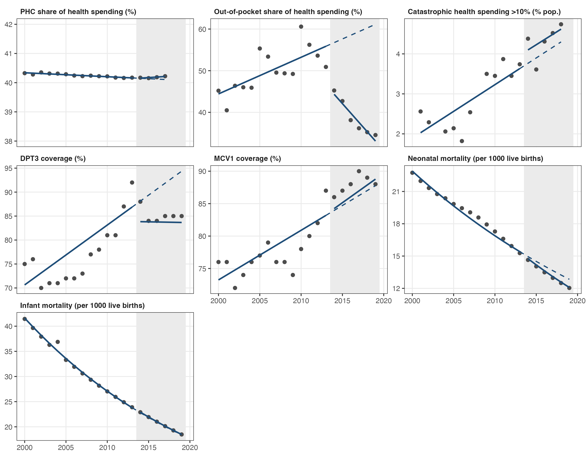

# Out-of-pocket share, catastrophic spending and primary care spending after Indonesia's national health insurance: an interrupted time series analysis, 2000-2019

Cinta Nurindah Sari

*Working paper. The results have not been peer reviewed.*

This repository has the data and R code for an interrupted time series analysis of Indonesia's national health insurance, Jaminan Kesehatan Nasional (JKN), which started in January 2014. The question is whether JKN changed financial protection, the share of health spending that goes to primary health care (PHC), immunization coverage and child mortality at the national level.



## Approach

Annual national data from 2000 to 2019. The series stops before COVID-19.

Each outcome is modelled with segmented regression, with a level change in 2014 and a change in the yearly trend after 2014. The main model is GLS with AR(1) errors, fitted by maximum likelihood. Mortality outcomes are modelled on the log scale and reported as percent change.

Sensitivity analyses use OLS with Newey-West standard errors, 2015 as the interruption year, and a shorter pre-period starting in 2005. A placebo test moves the interruption to each year from 2006 to 2011 using pre-JKN data only.

## Outcomes and data sources

| Outcome | Source | Years used |
|---|---|---|
| Out-of-pocket (OOP) share of current health expenditure | WHO Global Health Expenditure Database | 2000-2019 |
| Catastrophic health spending, more than 10% of household budget (SDG 3.8.2) | WHO and World Bank, based on Susenas | 2001-2018, with gaps |
| PHC share of health spending | IHME LMIC primary health care spending estimates | 2000-2017 |
| DPT3 and MCV1 coverage | WHO and UNICEF estimates of national immunization coverage | 2000-2019 |
| Neonatal and infant mortality | UN Inter-agency Group for Child Mortality Estimation | 2000-2019 |

Notes on the data:

- Catastrophic spending stops at 2018. From 2019, WHO's estimates for Indonesia are based on a reprocessed Susenas series, and the September 2019 Susenas changed its out-of-pocket health questions, so 2019 is not comparable with earlier years.
- The PHC spending series is modelled by IHME, has wide uncertainty and stops in 2017.
- Neonatal and infant mortality are modelled estimates, which makes them very smooth over time.

## Master file variables

Both master files have the same 12 columns. Every value was checked against the raw files in `02_data_raw`.

| Variable | Description | Unit | Source |
|---|---|---|---|
| `year` | Calendar year | | |
| `the_mil` | Total health expenditure | 2017 USD, millions | IHME |
| `phc_mil` | Primary health care expenditure | 2017 USD, millions | IHME |
| `phc_share_mil` | PHC share of health spending, `phc_mil / the_mil` | proportion | IHME |
| `oop_share` | Out-of-pocket share of current health expenditure | proportion | WHO GHED |
| `che_incidence` | Population with health spending above 10% of household budget | proportion | WHO and World Bank |
| `dpt3_coverage` | DPT3 coverage among surviving infants | proportion | WHO and UNICEF |
| `mcv1_coverage` | MCV1 coverage among surviving infants | proportion | WHO and UNICEF |
| `nmr` | Neonatal mortality rate | per 100 live births | UN IGME |
| `imr` | Infant mortality rate | per 100 live births | UN IGME |
| `mmr` | Maternal mortality ratio | per 100,000 live births | WHO and partners (MMEIG) |
| `gdp_pc` | GDP per capita, PPP | constant 2021 international $ | World Bank |

`phc_master_file_v1.xlsx` covers 2000-2017. `build_master_v2.R` adds 2018 and 2019 from the files in `02_data_raw/2019_update` and replaces infant mortality with the latest UN IGME release, giving `phc_master_file_v2.xlsx`. Maternal mortality and GDP are not used in the models but are kept for reference. The analysis script converts shares to percentages and mortality to per 1,000 live births.

## Main results

OOP share fell by 12.4 percentage points in 2014 (95% CI -19.3 to -5.5). The drop holds in every sensitivity analysis, and no placebo year shows a similar drop. The faster decline after 2014 is not specific to JKN, because a similar trend change shows up with a placebo break in 2010.

Catastrophic health spending, DPT3 and MCV1 coverage, and infant mortality did not change after JKN. The PHC share of health spending stayed at about 40%, and the estimated change by 2017 was about 0.1 percentage points. The faster decline in neonatal mortality appears at almost any placebo year, so it cannot be attributed to JKN.

Full results are in `05_results`.

## Repository structure

```
02_data_raw/
  2019_update/        WHO and World Bank downloads, 2000-2019
  IHME/THE/           IHME total health spending, Indonesia
  IHME/PHC_Spending/  IHME primary health care spending, LMICs
  UNICEF/NMR/         UN IGME neonatal mortality estimates
  WHO/MMR/            maternal mortality estimates (MMEIG)
03_data_clean/
  phc_master_file_v1.xlsx   master file for 2000-2017
  build_master_v2.R         extends the master file to 2019
  phc_master_file_v2.xlsx   master file for 2000-2019, used in the analysis
  phc_data_analysis/
    phc_data_analysis.R     descriptives, ITS models, sensitivity and placebo tests, figure
05_results/
  table1_descriptives.csv
  table2_its_main.csv       main ITS estimates
  tableS1_sensitivity.csv
  tableS2_placebo.csv
  its_estimates_all.csv     all estimates with p-values
06_outputs/
  fig1_its.png, fig1_its.pdf
```

## How to run

1. Run `03_data_clean/build_master_v2.R` with `03_data_clean` as the working directory. This rebuilds `phc_master_file_v2.xlsx`.
2. Open `03_data_clean/phc_data_analysis/phc_data_analysis.Rproj` in RStudio and run `phc_data_analysis.R`. Tables are saved to `05_results` and the figure to `06_outputs`.

Built with R 4.4.2 and tidyverse 2.0.0, readxl 1.4.5, jsonlite 1.8.9, openxlsx 4.2.8.1, sandwich 3.1.1, lmtest 0.9.40 and nlme 3.1.166.

## Data sources

- Institute for Health Metrics and Evaluation (IHME). Low- and Middle-Income Country Primary Health Care Spending 2000-2017. Seattle: IHME; 2021.
- Institute for Health Metrics and Evaluation (IHME). Health spending by health care function and provider, Indonesia 2000-2017. Seattle: IHME; 2021.
- World Health Organization. Global Health Expenditure Database: out-of-pocket expenditure as % of current health expenditure. WHO Global Health Observatory, accessed October 2026.
- World Health Organization and World Bank. Population with household expenditures on health greater than 10% of total household expenditure or income (SDG 3.8.2). WHO Global Health Observatory, accessed October 2026.
- WHO and UNICEF. Estimates of national immunization coverage (DTP3, MCV1). WHO Global Health Observatory, accessed October 2026.
- UN Inter-agency Group for Child Mortality Estimation (UN IGME). Neonatal and infant mortality estimates, 2025 release. UNICEF and WHO.
- WHO, UNICEF, UNFPA, World Bank Group and UN Population Division (MMEIG). Trends in maternal mortality estimates, 2000-2023. April 2025.
- World Bank. World Development Indicators: GDP per capita, PPP (constant 2021 international $), NY.GDP.PCAP.PP.KD. Accessed October 2026.

All data are publicly available aggregate statistics and remain under the terms of use of the original sources. No individual-level data are included.
